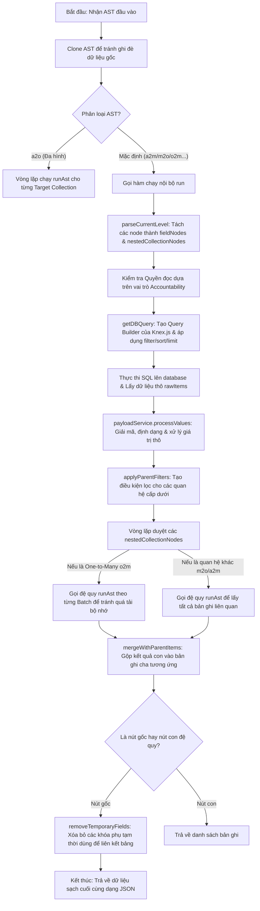

# Kiến trúc Hệ thống & Cơ chế Xử lý Truy vấn Động thông qua AST

Tài liệu này mô tả chi tiết kiến trúc tổng quan của sản phẩm **Backoffice** và đi sâu vào cơ chế cốt lõi nhất của hệ thống: **Luồng xử lý truy vấn động từ Abstract Syntax Tree (AST)** nằm tại thư mục `api/src/database/run-ast`.

---

## 🏗️ 1. Kiến trúc Tổng quan (System Overview)

Hệ thống Backoffice hoạt động dưới mô hình Headless CMS / Real-time API Engine, giúp tự động ánh xạ cơ sở dữ liệu quan hệ (SQL Database) thành cả hai cổng giao tiếp REST API và GraphQL API theo thời gian thực.

```
┌─────────────────────────────────────────────────────────┐
│                    Client App / SDK                     │
└────────────────────────────┬────────────────────────────┘
                             │ (REST / GQL / WS)
                             ▼
┌─────────────────────────────────────────────────────────┐
│                   Express API Gateway                   │
│  - Định tuyến (Routing)                                 │
│  - Xác thực & Phân quyền (Auth & IAM)                   │
└────────────────────────────┬────────────────────────────┘
                             │
                             ▼
┌─────────────────────────────────────────────────────────┐
│                AST Parser (Bộ phân tích)                │
│  Chuyển đổi URL params hoặc GraphQL query thành AST     │
└────────────────────────────┬────────────────────────────┘
                             │
                             ▼
┌─────────────────────────────────────────────────────────┐
│          runAst Engine (Quy trình thực thi)             │
│  - Phân tích cấu trúc node (Field, Relational, Function)│
│  - Áp dụng quyền hạn đọc dữ liệu                       │
│  - Sinh câu lệnh SQL thông qua Knex.js                  │
│  - Đệ quy lấy các mối quan hệ (O2M, M2O, A2M)           │
└────────────────────────────┬────────────────────────────┘
                             │
                             ▼
┌─────────────────────────────────────────────────────────┐
│                   SQL Database Layer                    │
│   (PostgreSQL, MySQL, SQLite, MSSQL, Oracle)            │
└─────────────────────────────────────────────────────────┘
```

---

## 🌳 2. Khái niệm Abstract Syntax Tree (AST) trong Backoffice

Khi client gửi một yêu cầu truy xuất dữ liệu (ví dụ: lấy danh sách bài viết kèm theo thông tin tác giả và bình luận), hệ thống không trực tiếp biên dịch tham số URL thành SQL. Thay vào đó, Backoffice chuyển đổi truy vấn đó thành một cây cú pháp trừu tượng (AST) nội bộ.

Mỗi nút (node) trong AST đại diện cho một trường thông tin cần lấy hoặc một quan hệ liên kết:

1. **`FieldNode`**: Đại diện cho cột dữ liệu nguyên bản (Primitive column) trong bảng (ví dụ: `title`, `created_at`). Đây là nút lá của cây.
2. **`FunctionFieldNode`**: Đại diện cho cột dữ liệu được tính toán thông qua hàm SQL (ví dụ: `count()`, `year()`, định dạng trường JSON).
3. **`Relational Nodes` (`M2ONode`, `O2MNode`, `A2MNode`)**: Đại diện cho mối quan hệ giữa các bảng.
   * **Many-to-One (`m2o`)**: Bài viết -> Tác giả.
   * **One-to-Many (`o2m`)**: Bài viết -> Danh sách bình luận.
   * **Any-to-Many (`a2m`)**: Các mối quan hệ đa hình phức tạp.
   * *Các nút quan hệ này sẽ chứa các nút con (children) riêng biệt bên trong chúng, tạo thành cấu trúc cây phân cấp sâu.*

---

## 🔄 3. Chi tiết Luồng Xử lý của `runAst()`

Hàm khởi tạo thực thi chính nằm tại `api/src/database/run-ast/run-ast.ts` với signature:
```typescript
export async function runAst(
	originalAST: AST | NestedCollectionNode,
	schema: SchemaOverview,
	accountability: Accountability | null,
	options?: RunASTOptions,
): Promise<null | Item | Item[]>
```

Sơ đồ tuần tự các bước xử lý bên trong `runAst`:



---

## 🔍 4. Bản đồ các File mã nguồn cốt lõi trong `run-ast/`

Để tìm hiểu và chỉnh sửa luồng xử lý truy vấn động, lập trình viên cần chú ý các file sau:

* **[run-ast.ts](file:///Users/hien/Fpt/Sources/backoffice/backoffice/api/src/database/run-ast/run-ast.ts)**: Chứa hàm chạy chính `runAst()`, điều phối việc phân tích các cấp độ cây, gọi đệ quy các quan hệ con, thực hiện phân trang theo lô (`RELATIONAL_BATCH_SIZE`) và gộp kết quả.
* **[lib/get-db-query.ts](file:///Users/hien/Fpt/Sources/backoffice/backoffice/api/src/database/run-ast/lib/get-db-query.ts)**: Biên dịch các node thuộc cấp hiện tại thành câu lệnh SQL của Knex.js. Xử lý các phép toán nhóm (`groupBy`), tính tổng hợp (`aggregate`), sắp xếp nhiều bảng và phân trang.
* **[lib/parse-current-level.ts](file:///Users/hien/Fpt/Sources/backoffice/backoffice/api/src/database/run-ast/lib/parse-current-level.ts)**: Phân tách các nút của AST cấp hiện tại thành các nhóm riêng biệt để chuẩn bị cho câu lệnh SQL hoặc đệ quy.
* **[lib/apply-query/index.ts](file:///Users/hien/Fpt/Sources/backoffice/backoffice/api/src/database/run-ast/lib/apply-query/index.ts)**: Áp dụng các điều kiện lọc nâng cao (`filter`), tìm kiếm toàn văn, giới hạn số lượng và phân trang lên câu lệnh SQL.
* **[utils/merge-with-parent-items.ts](file:///Users/hien/Fpt/Sources/backoffice/backoffice/api/src/database/run-ast/utils/merge-with-parent-items.ts)**: Thuật toán ánh xạ và gộp mảng kết quả của các bảng con vào đúng thuộc tính của các bản ghi cha tương ứng bằng cách đối chiếu khóa ngoại/khóa chính.
